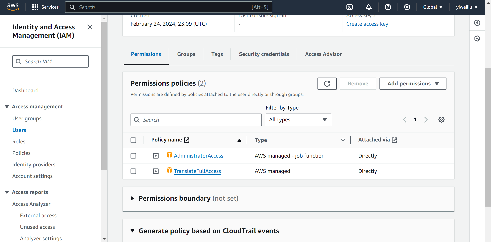

## Serverless REST Assignment.

__Name:__ Yiwei Liu

__Video demonstration:__ https://youtu.be/5dLQK82JmYU (I'm sorry I have to use AI voiceover because I have a bad cough)

This repository contains an implementation of a serverless REST API for the AWS platform. The CDK framework is used to provision its infrastructure. The API's domain context is movie reviews.

### API endpoints.
 
+ POST /movies/reviews - add a movie review.
+ GET /movies/{movieId}/reviews - Get all the reviews for the specified movie.
+ GET /movies/{movieId}/reviews?minRating=n - Get the reviews for the specified movie with a rating greater than the minRating.
+ GET /movies/{movieId}/reviews/{reviewerName} - + Get the review written by the named reviewer for the specified movie.
+ PUT /movies/{movieId}/reviews/{reviewerName} - Update the text of a review.
+ GET /movies/{movieId}/reviews/{year} - Get the reviews written in a specific year for a specific movie.
+ GET /reviews/{reviewerName} - Get all the reviews written by a specific reviewer.
+ GET /reviews/{reviewerName}/{movieId}/translation?language=code - Get a translated version of a movie review using the movie ID and reviewer name as the identifier.

### Authentication.

### Independent learning.

1. In this assignment I have 2 stacks, for auth API and app API, respectively. To use authentication in app API stack, we can out put the userpool in auth API stack and import them in app API stack.

+ Related source files: 

  + lib/auth-app-stack.ts
  + lib/rest-api-stack.ts

2. Command to deploy/destroy multiple stacks: 

    `ckd deploy --all`
    `ckd destroy --all`

3. The translation endpoint returns an error related to IAM policies:
    
    However, I have had the permission of translation service in IAM user:
    
    Therefore, this problem remains unsolved.

+ Related source files: 

  + lib/rest-api-stack.ts
  + lambdas/getTranslation.ts.ts
